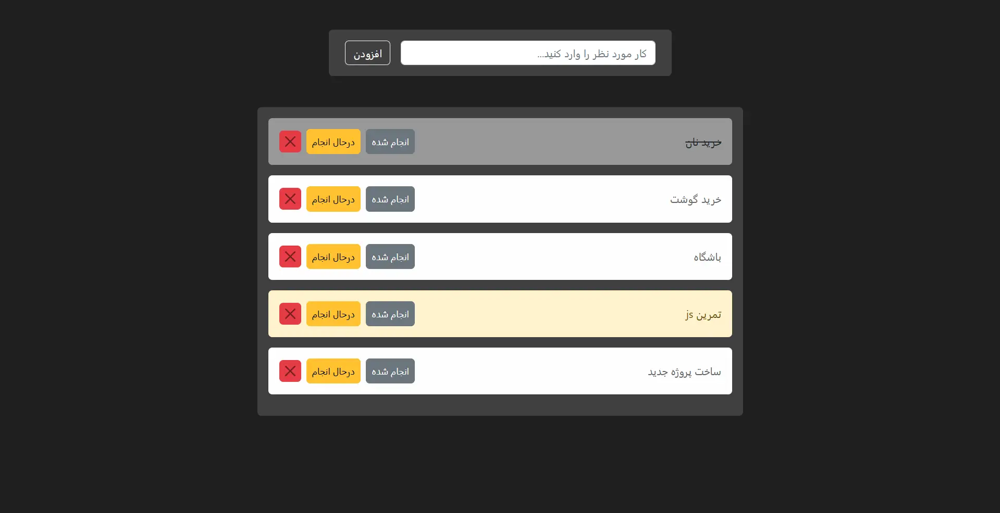
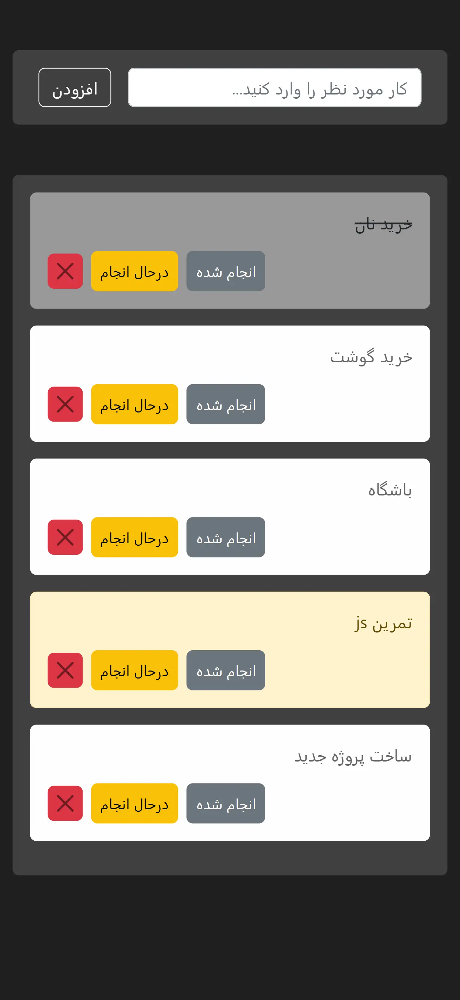

# 📝 ToDo List

A simple and responsive ToDo List application built with **HTML, CSS, JavaScript, and Bootstrap**.

## 🚀 Features

* Add new tasks
* Mark tasks as **Doing** or **Done**
* Delete tasks
* Save tasks in **Local Storage**
* Restore tasks after refreshing the page
* Responsive layout using Bootstrap

## 🛠️ Technologies

* HTML5
* CSS3
* JavaScript (Vanilla JS)
* Bootstrap 5
* Local Storage

## Project Preview

### Desktop

### Mobile

## Live Demo

[View Live Demo](https://hosseinmehrbakhsh.github.io/todo-list/)

## Author

Hossein Mehrbakhsh

## 🎯 Purpose

This project was created as a practice project while learning **JavaScript**, with a focus on DOM manipulation, event handling, and browser Local Storage.